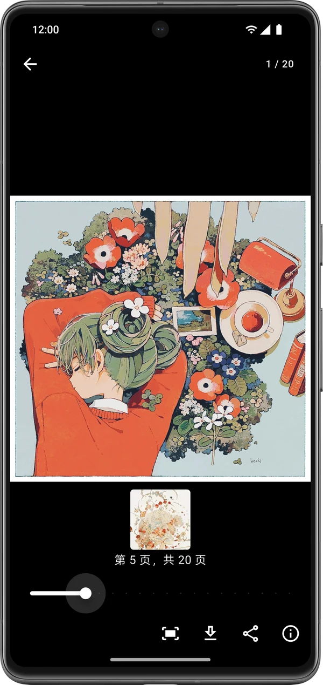
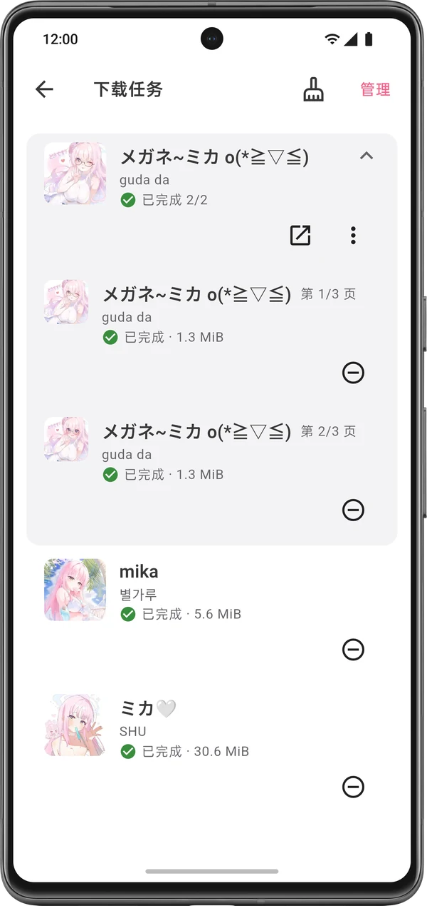

<div align="center">


[](https://github.com/Lopution/Parfait/releases/latest)
[](#download)
[](LICENSE)
[](https://github.com/Lopution/Parfait/actions/workflows/ci.yml)

**[Download the latest release](https://github.com/Lopution/Parfait/releases/latest)**

[简体中文](README.md) | English

</div>

> [!NOTE]
> Parfait is an unofficial client and is not affiliated with pixiv Inc. All works belong to their creators.
>
> Parfait is in public beta (0.9.x). Bug reports are welcome in [Issues](https://github.com/Lopution/Parfait/issues).

Parfait is an unofficial pixiv client for Android. Browse, bookmark and download illustrations, manga and novels, with an interface in English, 日本語, Русский or 中文.

- **No ads, no tracking**: no advertising, analytics or telemetry components of any kind.
- **Offline-safe actions**: bookmarks, follows and series subscriptions made offline are queued and sent once you are back online.
- **Verified updates**: the in-app updater checks the signature and signing certificate before handing the APK to the system installer.
- **Works where pixiv is blocked**: in mainland China it connects to pixiv directly, without a proxy, and only for pixiv's own domains.

Parfait is written in Flutter with a Material Design 3 interface, using Riverpod for state and go_router for navigation. The network layer is a native Rust component adapted from [rhttp](https://codeberg.org/Tienisto/rhttp) (reqwest, rustls and tokio, bridged with flutter_rust_bridge); this is where DoH resolution, ECH and the other connection methods behind direct access live. Local data is kept in SQLite, and login credentials in the system's secure storage.

## Screenshots

<table align="center">
<tr>
<td align="center" width="25%"><br><b>Recommended</b><br><sub>Illustrations, manga, novels and users</sub></td>
<td align="center" width="25%"><br><b>Artwork</b><br><sub>Download, comment and bookmark in reach</sub></td>
<td align="center" width="25%"><br><b>Search</b><br><sub>Features, trending tags, reverse image search</sub></td>
<td align="center" width="25%"><br><b>Artist</b><br><sub>Works, bookmarks and follows</sub></td>
</tr>
<tr>
<td align="center"><br><b>Rankings</b><br><sub>Daily, weekly and more, by date</sub></td>
<td align="center"><br><b>Novel reader</b><br><sub>Font size, translation, reading progress</sub></td>
<td align="center"><br><b>Viewer</b><br><sub>Scrub through pages, save and share</sub></td>
<td align="center"><br><b>Downloads</b><br><sub>Multi-page works grouped, progress at a glance</sub></td>
</tr>
</table>

## Features

**Browse and discover**

- Recommendations and rankings for illustrations, manga and novels, plus pixivision features
- Search with sorting and filters (bookmark count, date, AI-generated works) and trending tags
- Reverse image search to find a picture's source: SauceNAO, IQDB, ascii2d, TinEye
- Ugoira playback, with saving as GIF

**Network**

- Direct by default; when the direct route is blocked, compatibility routes are tried for pixiv's domains only, never for other traffic
- A built-in network probe checks DNS poisoning and SNI blocking step by step and suggests settings
- Image source: automatic race, public mirrors such as pixiv.re, or your own reverse proxy

**Reading**

- Novel reader with adjustable font size and line spacing, and paper, eye-care and night themes
- Follow manga and novel series and see new chapters at a glance
- Import local TXT novels with automatic encoding detection

**Collections**

- Bookmarks (with tags), follows, watch later and history
- Mute tags, users or works; hide R-18 or AI-generated works locally

**Downloads**

- Batch downloads, or every work of an artist in one go
- Pause and resume, with configurable parallelism and file name templates
- Optionally save title, artist and caption to a TXT file next to each work

**Comments**

- Emoji and stickers
- One-tap translation (Google Translate, Baidu Translate, or any OpenAI-compatible endpoint)

**More**

- Multiple accounts; move your login to another device
- Back up and import settings, mute lists and history
- Home screen widget with recommended works
- Light and dark themes, with colours from your wallpaper

## Download

Download an APK from [Releases](https://github.com/Lopution/Parfait/releases/latest):

| File | For |
|---|---|
| `parfait-v<version>-github-arm64-v8a.apk` | Almost every phone; pick this if unsure |
| `parfait-v<version>-github-armeabi-v7a.apk` | Older 32-bit devices |

Android 10 or later is required.

GitHub Releases is the only official source. Copies elsewhere may have been modified; check them against the certificate fingerprint below.

Updates are available under **Me → About → Check for updates**: the app downloads the new version and verifies its signature, hash and signing certificate before installing. You can also track this repository's releases with [Obtainium](https://github.com/ImranR98/Obtainium).

A Windows build is in preparation and will ship as a preview.

<details>
<summary>APK signing certificate</summary>

Every APK on Releases is signed with the same certificate. On the phone you can check it with [AppVerifier](https://github.com/soupslurpr/AppVerifier); package name and fingerprint should be:

```text
io.github.lopution.parfait
D0:B4:1A:FC:87:B7:D2:07:51:1A:52:BD:8C:CC:A6:56:3C:67:3C:2D:F1:0A:67:71:D1:C3:38:4A:B6:5C:B1:12
```

On a computer, use `apksigner` from the Android SDK:

```bash
apksigner verify --print-certs parfait-v<version>-github-arm64-v8a.apk
```

The output should contain:

```text
Signer #1 certificate SHA-256 digest: d0b41afc87b7d207511a52bd8ccca6563c673c2df10a6771d1c3384ab65cb112
```

</details>

## Signing in

Sign-in uses pixiv's official web page. In mainland China, signing in or registering needs a proxy set up in the system or another app (Parfait has no built-in proxy); after that, browsing and downloads connect directly.

Already signed in on another device? There, open **Me → Accounts → Export account credential**, then choose **Log in with clipboard data** on the new device's sign-in page.

## FAQ

<details>
<summary>Pages or images load slowly or not at all?</summary>

Run the **Network probe** under **Me → Network** and adjust the network mode as it suggests. For slow images, choose **Auto** or another mirror under **Me → Network → Image source**.

</details>

<details>
<summary>How does direct access work, and is it safe?</summary>

The app tries several connection methods in turn (an ECH-encrypted handshake through Cloudflare, addresses resolved over encrypted DNS, connecting to pixiv's servers without SNI, and a plain system connection) and remembers the one that works. **Every method fully verifies the HTTPS certificate**: if the server is not pixiv's, the connection fails. These methods apply to pixiv's domains only and never to other traffic.

To use plain system connections only, set **Me → Network → Network mode** to **Direct only**. In mainland China you will then usually need your own proxy.

</details>

<details>
<summary>Where are downloads saved?</summary>

By default, in the **Parfait** album of your gallery. Under **Me → Download settings → Save location** you can pick a custom album name or any folder through the system folder picker; file name templates are in the download settings too.

</details>

<details>
<summary>How is this related to Pixiv Func, and why the name Parfait?</summary>

Parfait started from git-xiaocao's Pixiv Func and is a rewrite based on its open-source code; it is not released by the original author. pixiv's trademark guidelines do not allow other products to use "pixiv" in their names, hence the new name. The package names differ, so both can be installed side by side.

</details>

<details>
<summary>How do I report a problem?</summary>

Describe the problem and how to reproduce it in [Issues](https://github.com/Lopution/Parfait/issues). **Me → About → Export logs** exports the app's local log, which helps a lot; check that it contains nothing you would rather keep private before attaching it. Please report security issues privately as described in [SECURITY.md](SECURITY.md).

</details>

## Contact

- Bug reports and feature requests: [Issues](https://github.com/Lopution/Parfait/issues)
- Email: [fuyian533@gmail.com](mailto:fuyian533@gmail.com)

## Respect the creators

Downloaded works are for your personal collection. Please do not repost, re-upload or use other people's works commercially. If you like a work, a bookmark or follow on pixiv is the most direct support for its creator.

## Privacy

- No user data is collected; there are no analytics, telemetry or advertising components.
- Three permissions only: network; vibration (for haptic feedback, granted at install); and installing apps (for in-app updates; the system still asks you to confirm each install).
- Login credentials are kept in the system's secure storage. Logs stay on the device unless you export them.
- Text or images are sent to a translation or reverse image search service only when you use that feature, and only to the service you chose.

## Contributing

Issues and pull requests are welcome. See [CONTRIBUTING.md](CONTRIBUTING.md) for how to build and the project conventions.

## Acknowledgements

- Pixiv Func by git-xiaocao. The original repository is no longer available; the source archive this project referred to is [svenfuss/pixiv_func_mobile](https://github.com/svenfuss/pixiv_func_mobile). See [NOTICE](NOTICE) for attribution and changes.
- [PixEz](https://github.com/Notsfsssf/pixez-flutter) and [Pixiv-Shaft](https://github.com/CeuiLiSA/Pixiv-Shaft): references for design and implementation.
- [rhttp](https://codeberg.org/Tienisto/rhttp): the Rust HTTP client behind the network layer.

## License

[AGPL-3.0-only](LICENSE)
