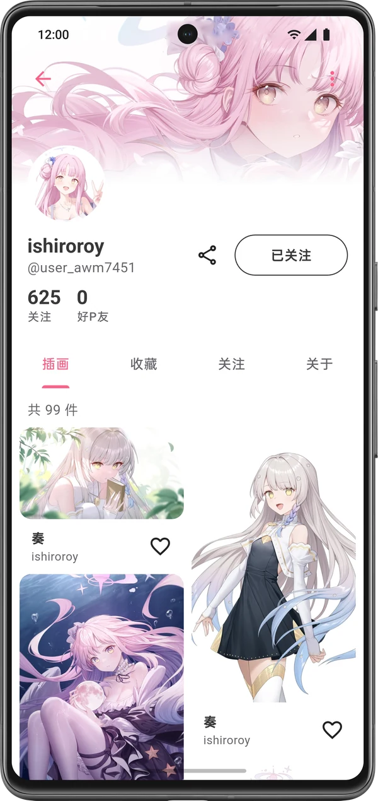
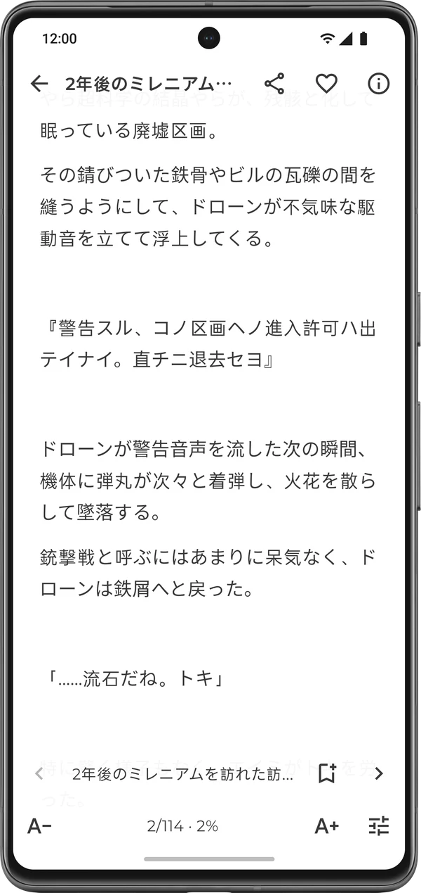

<div align="center">


[](https://github.com/Lopution/Parfait/releases/latest)
[](#下载与安装)
[](LICENSE)
[](https://github.com/Lopution/Parfait/actions/workflows/ci.yml)

**[下载最新版](https://github.com/Lopution/Parfait/releases/latest)**

</div>

> [!NOTE]
> 本项目是非官方的第三方客户端，与 pixiv Inc. 无关。作品版权归各自的创作者所有。

Parfait 是 Android 上的 pixiv 第三方客户端，可以浏览、收藏和下载插画、漫画与小说。在中国大陆网络下，浏览和下载可以直接连接 pixiv，不需要一直开着代理（首次登录除外，见[登录](#登录)）。

## 截图

<table align="center">
<tr>
<td align="center" width="33%"><br><b>推荐</b><br><sub>插画、漫画、小说的个性化推荐</sub></td>
<td align="center" width="33%"><br><b>作品详情</b><br><sub>标签、作者信息，一键下载与收藏</sub></td>
<td align="center" width="33%"><br><b>搜索</b><br><sub>关键词与热门标签、反向搜图、特辑</sub></td>
</tr>
<tr>
<td align="center"><br><b>画师主页</b><br><sub>作品、收藏与关注一览</sub></td>
<td align="center"><br><b>排行</b><br><sub>每日、每周、每月榜单</sub></td>
<td align="center"><br><b>小说阅读</b><br><sub>字号、行距与配色可调</sub></td>
</tr>
</table>

## 功能

**浏览与发现**

- 插画、漫画、小说的推荐、排行与 pixivision 特辑
- 搜索支持排序和筛选（收藏数、发布时间、AI 作品），查看热门标签
- 反向搜图，查找图片出处：SauceNAO、IQDB、ascii2d、TinEye
- 播放动图，并可保存为 GIF

**网络**

- 默认直连；直连被阻断时自动尝试兼容通道，只作用于 pixiv 的域名，不代理其他流量
- 内置网络诊断，逐项检查 DNS 污染、SNI 阻断并给出设置建议
- 图片源可选自动竞速、pixiv.re 等公共镜像或自定义反代

**阅读**

- 小说阅读可调字号、行距，有纸张、护眼、夜间三种配色
- 追更漫画和小说系列，有更新时一目了然
- 导入本地 TXT 小说，自动识别编码

**收藏与整理**

- 收藏（可加标签）、关注、稍后再看、浏览历史
- 离线时点的收藏、关注和追更，联网后自动补发，不会丢
- 按标签、用户、作品屏蔽内容；可在本地屏蔽 R-18 或 AI 作品

**下载**

- 批量下载，也能一键下载某位作者的全部作品
- 任务可暂停、继续，可设置并行数和文件命名模板
- 可同时把标题、作者和简介保存为同名 TXT

**评论**

- 发送 Emoji 和贴图
- 一键翻译评论（Google 翻译、百度翻译，或自定义 OpenAI 兼容接口）

**其他**

- 多账号切换；可把登录状态迁移到另一台设备
- 备份与导入设置、屏蔽列表和浏览历史
- 桌面小部件，展示推荐作品
- 中文、English、日本語、Русский 界面，跟随系统的浅色与深色主题
- 应用内检查更新，安装前校验签名与证书

## 下载与安装

在 [Releases](https://github.com/Lopution/Parfait/releases/latest) 页面下载 APK：

| 文件 | 适用设备 |
|---|---|
| `parfait-v版本号-github-arm64-v8a.apk` | 绝大多数手机，不确定就选它 |
| `parfait-v版本号-github-armeabi-v7a.apk` | 较旧的 32 位设备 |

需要 Android 10 或更高版本。

本项目只在 GitHub Releases 发布。网盘、群文件等其他渠道都是第三方转载，可能被改动过，请以 Releases 为准，或按下方的证书指纹核对。

之后的更新可以在「我的 → 关于 → 检查更新」中完成：应用会下载新版本，校验签名、哈希和签名证书后再交给系统安装。也可以用 [Obtainium](https://github.com/ImranR98/Obtainium) 订阅本仓库的 Releases。

Windows 版还在准备中，之后会以预览版发布。

<details>
<summary>APK 签名证书指纹</summary>

正式发布的 APK 都使用同一个证书签名。在手机上可以用 [AppVerifier](https://github.com/soupslurpr/AppVerifier) 核对，包名和指纹应为：

```text
io.github.lopution.parfait
D0:B4:1A:FC:87:B7:D2:07:51:1A:52:BD:8C:CC:A6:56:3C:67:3C:2D:F1:0A:67:71:D1:C3:38:4A:B6:5C:B1:12
```

在电脑上可以用 Android SDK 的 `apksigner` 核对：

```bash
apksigner verify --print-certs parfait-v版本号-github-arm64-v8a.apk
```

输出中应包含：

```text
Signer #1 certificate SHA-256 digest: d0b41afc87b7d207511a52bd8ccca6563c673c2df10a6771d1c3384ab65cb112
```

</details>

## 登录

登录使用 pixiv 官方网页。由于网络环境限制，**登录和注册需要先在系统或其他应用中开启代理**，Parfait 不提供内置代理；登录完成后，浏览和下载都可以直连。

如果你已经在另一台设备上登录过，可以在那台设备的「设置」中选择「导出账号凭据」，再在新设备登录页选择「使用剪贴板数据登录」。

## 常见问题

<details>
<summary>打不开页面或图片加载很慢？</summary>

在「我的 → 网络」中运行「分层连通性探测」，按结论调整网络模式；图片慢可以在「我的 → 网络 → 图片源」中选择「自动」或其他镜像。

</details>

<details>
<summary>和 Pixiv Func 是什么关系？为什么叫 Parfait？</summary>

Parfait 源自 git-xiaocao 的 Pixiv Func，基于其开源代码重写，并非原作者发布。pixiv 的商标指南不允许其他产品的名称包含「pixiv」，所以本项目改名为 Parfait。两者包名不同，可以同时安装。

</details>

<details>
<summary>遇到问题怎么反馈？</summary>

请在 [Issues](https://github.com/Lopution/Parfait/issues) 中描述问题和复现步骤。在「我的 → 关于 → 导出日志」中可以导出本机日志，附在 Issue 里能帮助定位问题；提交前请确认日志里没有你不想公开的内容。

</details>

## 尊重创作者

下载的作品仅供个人收藏。请不要转载、二次上传或商用他人的作品；遇到喜欢的作品，去 pixiv 给创作者点个收藏、关注，是对他们最直接的支持。

## 隐私

- 不收集任何用户数据，不包含统计、遥测或广告组件；只申请网络权限。
- 登录凭据保存在系统安全存储中；日志只保存在本机，只有你主动导出时才会离开设备。
- 只有在你使用翻译或反向搜图时，相应的文字或图片才会发送给你选择的服务。

## 参与开发

欢迎通过 [Issues](https://github.com/Lopution/Parfait/issues) 反馈问题或提出建议。安全问题请不要公开提交，按 [SECURITY.md](SECURITY.md) 私下报告。

本地构建需要 Flutter 3.47.2 和 Rust 工具链（网络层的原生部分由 Rust 编译）。

## 致谢

- Pixiv Func：原作者 git-xiaocao（小草）。原仓库已无法访问，本项目参照的源码存档见 [svenfuss/pixiv_func_mobile](https://github.com/svenfuss/pixiv_func_mobile)；归属与修改说明见 [NOTICE](NOTICE)。
- [PixEz](https://github.com/Notsfsssf/pixez-flutter)、[Pixiv-Shaft](https://github.com/CeuiLiSA/Pixiv-Shaft)：设计与实现上的参考。
- [rhttp](https://codeberg.org/Tienisto/rhttp)：网络层所用的 Rust HTTP 客户端。

## 许可证

[AGPL-3.0-only](LICENSE)
